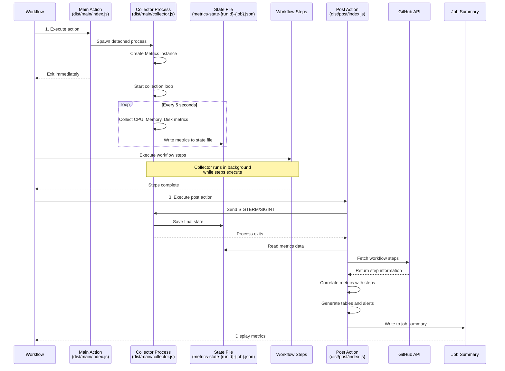

# Architecture

This document explains how the Workflow Metrics action works at a high level, including its execution phases, data collection, and storage mechanisms.

## Overview

The Workflow Metrics action is a custom GitHub Action that periodically collects system metrics (CPU, memory, and disk usage) during workflow execution. It operates in three distinct phases:

1. **Main Phase**: Spawns a background collector process
2. **Collection Phase**: Background collector gathers metrics periodically
3. **Post Phase**: Aggregates metrics and generates summary tables

## Execution Flow



### Text Description of Execution Flow

For accessibility, here is a text description of the execution flow diagram above:

1. **Main Action Execution**: The workflow executes the main action (`dist/main/index.js`), which immediately spawns a collector process as a detached background process and exits.

2. **Collector Process**: The collector process (`dist/main/collector.js`) creates a Metrics instance and starts a collection loop that runs every 5 seconds. During each cycle, it:
   - Collects CPU, memory, and disk usage metrics using the `systeminformation` library
   - Writes the metrics to a state file (`metrics-state-{runId}-{job}.json`)

3. **Workflow Steps Execution**: While the collector continues running in the background, the workflow executes its regular steps (checkout, build, test, etc.).

4. **Post Action Execution**: After all workflow steps complete, the post action (`dist/post/index.js`) executes. It:
   - Sends a SIGTERM or SIGINT signal to the collector process
   - Waits for the collector to save its final state and exit
   - Reads the complete metrics data from the state file
   - Fetches workflow step information from the GitHub API
   - Correlates the collected metrics with workflow steps by timestamp
   - Generates formatted tables showing metrics for each step
   - Detects threshold violations and generates alerts
   - Writes the tables and alerts to the GitHub Actions job summary

5. **Display**: The metrics tables and any alerts are displayed in the GitHub Actions job summary for review.

## Key Components

### Main Action (`src/main/index.ts`)

The main action entry point is responsible for:
- Spawning the collector process as a detached background process
- Exiting immediately to allow the workflow to continue

The detached process ensures the collector runs independently and survives after the main action completes.

### Collector Process (`src/main/collector.ts`)

A simple background process that:
- Creates a Metrics instance
- Keeps running throughout the workflow
- Handles SIGTERM/SIGINT signals to ensure metrics are saved on termination
- Calls `stop()` on the Metrics instance to save state before exiting

### Metrics Collection (`src/main/metrics.ts`)

The core metrics collection component:
- **Initialization**: Starts async collection in the constructor
- **Periodic Collection**: Collects metrics every 5 seconds using drift-compensated timers
- **Data Collection**: Uses `systeminformation` library to gather:
  - CPU usage (user and system, 0-100%)
  - Memory usage (active and available in MB)
  - Disk usage (used and available in GB for root filesystem only)
- **In-Memory Storage**: Stores all metrics in memory during collection
- **Persistent Storage**: Writes to state file after each collection cycle
- **Drift Compensation**: Uses `Math.max(0, nextUNIXTimeMs - Date.now())` for precise 5-second intervals

### Post Action (`src/post/index.ts` and `src/post/lib.ts`)

The post action phase:
- **State Retrieval**: Reads metrics from the state file in GitHub state directory
- **API Integration**: Fetches workflow steps from GitHub API to correlate metrics with steps
- **Metric Aggregation**: Maps collected metrics to workflow steps by timestamp
- **Table Generation**: Creates formatted tables showing metrics for each step
- **Alert Detection**: Identifies threshold violations for CPU, memory, and disk
- **Summary Output**: Writes tables and alerts to GitHub Actions summary

### Renderer (`src/post/renderer.ts`)

Generates formatted output:
- **Alert Section**: Displays threshold violations with emoji icons (⚠️ memory, 🔥 CPU, 💾 disk)
- **Step Summary**: Shows which steps were tracked
- **Metric Tables**: Generates separate tables for:
  - CPU Usage (Total, Used, Available, Available %, Threshold Exceeded)
  - Memory Usage (Total, Used, Available, Available %, Threshold Exceeded)
  - Disk Usage (Total, Used, Available, Available %, Threshold Exceeded)

## Data Storage

### Storage Architecture

The action uses a file-based state storage mechanism that works reliably with detached processes:

```
GitHub State Directory (from GITHUB_STATE env var)
└── metrics-state-{runId}-{job}.json
```

**File Path Resolution**:
- Derived from `GITHUB_STATE` environment variable directory
- Fallback to `RUNNER_TEMP` if `GITHUB_STATE` is unavailable
- Filename includes workflow run ID and job name for uniqueness

### Why File-Based Storage?

GitHub Actions' built-in `saveState()` and `getState()` from `@actions/core` do not work reliably with detached processes. The file-based approach ensures:
- Data persists even if the collector is forcefully killed
- State is accessible across different action phases (main → post)
- Works with detached background processes
- Survives process boundaries

### Data Persistence Strategy

**During Collection**:
- Metrics stored in memory for fast access
- Written to state file after every collection cycle (every 5 seconds)
- Ensures data availability even with unexpected termination

**On Termination**:
- Collector handles SIGTERM/SIGINT signals
- Calls `stop()` method to ensure final state save
- Guarantees all collected metrics are persisted

**In Post Action**:
- Reads complete metrics history from state file
- Parses JSON data containing all collected samples
- Correlates timestamps with workflow steps
- Generates final summary tables

### Data Schema

Metrics are stored in a structured format defined in `src/lib.ts`:

```typescript
{
  cpuLoadPercentages: Array<{ unixTimeMs: number, user: number, system: number }>,
  memoryUsageMBs: Array<{ unixTimeMs: number, used: number, free: number }>,
  diskUsageGBs: Array<{ unixTimeMs: number, size: number, used: number, available: number }>,
  stepMarkers: Array<{ unixTimeMs: number, stepName: string, status: "start" | "end" }>
}
```

**Timestamp**: Unix timestamp in milliseconds for precise correlation with workflow steps

**CPU Metrics**:
- `user`: User-space CPU usage (0-100%)
- `system`: System-space CPU usage (0-100%)

**Memory Metrics**:
- `used`: Currently active memory in MB
- `free`: Available memory in MB

**Disk Metrics**:
- `size`: Total disk size in GB (root filesystem only)
- `used`: Used disk space in GB
- `available`: Available disk space in GB

**Step Markers**:
- `stepName`: Name of the workflow step
- `status`: Either "start" or "end" marking step boundaries

## Implementation Details

### Drift Compensation

To ensure accurate 5-second intervals, the collector uses drift-compensated timers:

```typescript
const nextUNIXTimeMs = Date.now() + intervalMs;
setTimeout(() => collect(), Math.max(0, nextUNIXTimeMs - Date.now()));
```

This approach:
- Calculates the exact next collection time
- Compensates for execution time of the collection itself
- Prevents drift accumulation over long-running workflows

### Process Lifecycle

**Main Action**:
1. Spawns collector with `detach: true` flag
2. Collector runs as independent process
3. Main action exits immediately

**Collector Process**:
1. Creates Metrics instance (starts collection automatically)
2. Runs until workflow completion or manual termination
3. Handles signals to ensure graceful shutdown
4. Saves final state before exiting

**Post Action**:
1. Waits for collector to complete
2. Reads persisted state
3. Fetches workflow context from GitHub API
4. Generates and outputs summary

### Node.js Compatibility

The action is designed for Node.js 24+ with:
- ES modules using `import.meta.url`
- `dirname(fileURLToPath())` for path resolution
- Avoids Bun-specific features for maximum compatibility

## Error Handling

### Collection Errors
- Individual collection failures are caught and handled
- Collection continues on transient errors
- Ensures partial data is still available

### State Persistence
- File writes are atomic operations
- Previous state preserved if write fails
- Post action handles missing or corrupted state gracefully

### API Failures
- GitHub API errors reported in summary
- Fallback to available data if step information unavailable
- Action continues even with partial data

## Performance Considerations

### Memory Usage
- In-memory storage during collection is minimal (< 1MB for typical workflows)
- State file size grows with workflow duration
- Typical file size: ~100KB for 30-minute workflow

### CPU Impact
- Collection process uses minimal CPU (< 1% typical)
- `systeminformation` library is efficient
- 5-second interval balances accuracy vs. overhead

### Disk I/O
- State file written every 5 seconds
- Small write operations (few KB per write)
- Negligible impact on workflow performance

## Security Considerations

### Permissions
- Requires `contents: read` to clone repository
- Requires `actions: read` to fetch workflow steps
- Minimal permission scope following least-privilege principle

### Data Privacy
- Only collects system resource metrics
- No access to workflow secrets or sensitive data
- All data stays within GitHub Actions environment

### Process Isolation
- Collector runs as separate detached process
- No shared memory with workflow steps
- Clean process boundaries prevent interference
